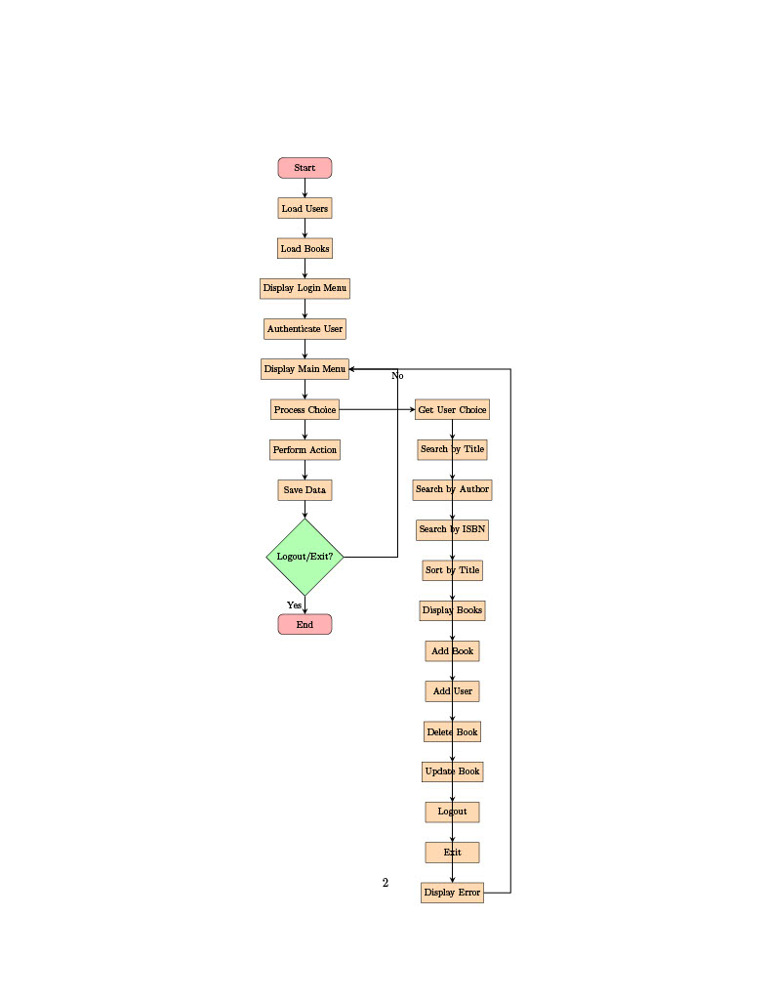
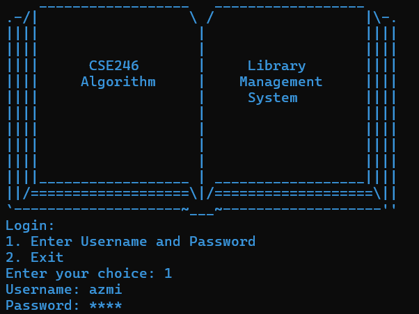
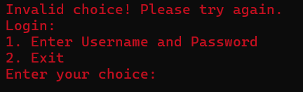
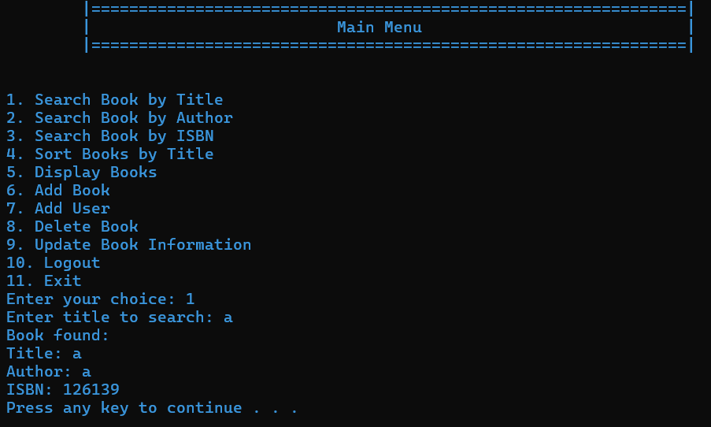
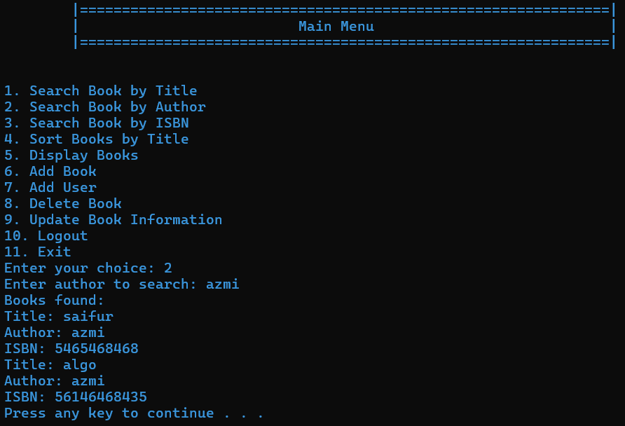
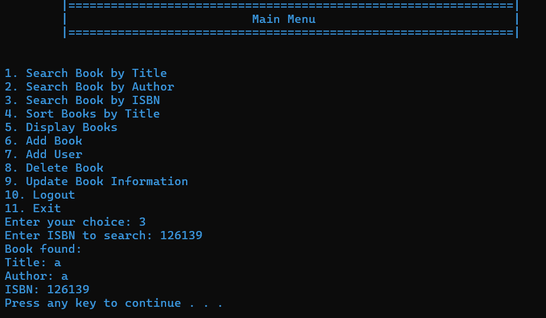
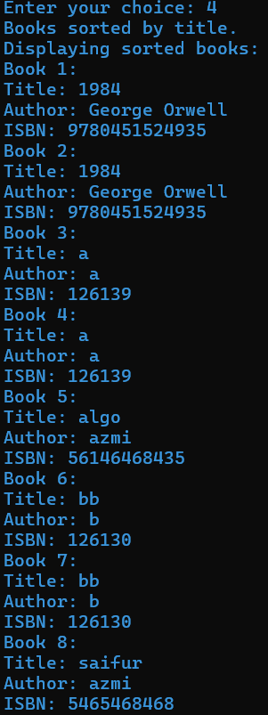

# CSE246-Algorithms-Project
CSE246-Algorithms-Project : Library_Management_System

**Project Report**

**Problem Statement:**

The task is to develop a **Library Management System** using the C
programming language that can manage a collection of books and user
accounts. The system should allow users (both regular users and
administrators) to log in, view, search, and manage books in the
library. Administrators will have additional privileges, including
adding, deleting, and updating books as well as adding new users.

**Objective:**

The main objective of the Library Management System is to create a
structured, easy-to-use interface for users to interact with library
resources. Specifically, the system should:

1.  Allow users to log in with a username and password.

2.  Enable users to search for books by title, author, or ISBN.

3.  Enable administrators to add and remove books and users, update book
    details, and manage library inventory.

**Algorithms:**

1.  Simple Hashing (Caesar Cipher):

    -   Function: [hashPassword](https://github.com/azizulabedinazmi/CSE246-Library_Management_System/blob/main/LIBRARY.c#L31)

    -   Purpose: Hashes the password using a simple Caesar cipher for
        demonstration purposes. Each character in the password is
        shifted by one.

2.  Password Input Masking:

    -   Function: [getPassword](https://github.com/azizulabedinazmi/CSE246-Library_Management_System/blob/main/LIBRARY.c#L40)

    -   Purpose: Hides the password input by displaying asterisks (\*)
        instead of the actual characters.

3.  File I/O Operations:

    -   Functions: [loadUsers](https://github.com/azizulabedinazmi/CSE246-Library_Management_System/blob/main/LIBRARY.c#L59), [saveUsers](https://github.com/azizulabedinazmi/CSE246-Library_Management_System/blob/main/LIBRARY.c#L76), [loadBooks](https://github.com/azizulabedinazmi/CSE246-Library_Management_System/blob/main/LIBRARY.c#L85), [saveBooks](https://github.com/azizulabedinazmi/CSE246-Library_Management_System/blob/main/LIBRARY.c#L98)

    -   Purpose: Reads and writes user and book data to and from files.

4.  Linear Search:

    -   Functions: [loginUser](https://github.com/azizulabedinazmi/CSE246-Library_Management_System/blob/main/LIBRARY.c#L107), [searchBookByTitle](https://github.com/azizulabedinazmi/CSE246-Library_Management_System/blob/main/LIBRARY.c#L178), [searchBookByAuthor](https://github.com/azizulabedinazmi/CSE246-Library_Management_System/blob/main/LIBRARY.c#L194)

    -   Purpose: Searches for a user by username and password, and
        searches for books by title or author.

5.  Binary Search:

    -   Function: [searchBookByISBN](https://github.com/azizulabedinazmi/CSE246-Library_Management_System/blob/main/LIBRARY.c#L215)

    -   Purpose: Searches for a book by ISBN after sorting the books by
        ISBN.

6.  Bubble Sort:

    -   Function: [sortBooksByTitle](https://github.com/azizulabedinazmi/CSE246-Library_Management_System/blob/main/LIBRARY.c#L273)

    -   Purpose: Sorts the books by title using a case-insensitive
        comparison.

7.  Basic CRUD Operations:

    -   Functions: [addUser](https://github.com/azizulabedinazmi/CSE246-Library_Management_System/blob/main/LIBRARY.c#L119), [addBook](https://github.com/azizulabedinazmi/CSE246-Library_Management_System/blob/main/LIBRARY.c#L140), [deleteBook](https://github.com/azizulabedinazmi/CSE246-Library_Management_System/blob/main/LIBRARY.c#L159), [updateBook](https://github.com/azizulabedinazmi/CSE246-Library_Management_System/blob/main/LIBRARY.c#L252)

    -   Purpose: Adds, deletes, and updates user and book records.

8.  Menu-Driven Interface:

    -   Function: [main](https://github.com/azizulabedinazmi/CSE246-Library_Management_System/blob/main/LIBRARY.c#L312)

    -   Purpose: Provides a text-based menu for user interaction and
        navigation through different functionalities.

**Flowchart:**

**Methodology:**

1.  **System Setup**:

    -   Use file-based data storage to persist user and book data.

    -   Initialize the system with admin credentials if no user file
        exists.

2.  **User Management**:

    -   Store hashed passwords to improve security.

    -   Users are classified as either regular users or admins, with
        additional permissions granted to admins.

3.  **Book Management**:

    -   Books are stored in a predefined structure that contains the
        title, author, and ISBN.

    -   Books can be searched by title, author, or ISBN, and are
        displayed in sorted order if required.

4.  **Error Handling**:

    -   The system handles invalid input for choices, incorrect login
        credentials, and unavailable books.

**Time Complexity:**

1.  **Login**:

    -   **Time Complexity**: $O(n),$ where n is the number of users.

    -   It compares the hashed password for each user in the list.

2.  **Book Search**:

    -   **Title/Author Search**: $O(n)$, where n is the number of books
        (linear search).

    -   **ISBN Search (Binary)**: $O(logn)$ for the search, but
        $O\left( n^{2} \right)$ for sorting using Bubble Sort (though
        better sorting algorithms like quicksort can reduce this).

3.  **Add Book**:

    -   **Time Complexity**: $O(1)$ since it adds a book at the end of
        the list.

4.  **Delete Book**:

    -   **Time Complexity**: $O(n)$, as deleting a book involves
        shifting all subsequent books by one position.

5.  **Sort Books by Title**:

    -   **Time Complexity**: $O\left( n^{2} \right)$, since it uses
        Bubble Sort (can be optimized to $O(nlogn$) using better sorting
        algorithms).

**Limitations:**

1.  **File-Based Storage**: The system uses text files for storage,
    which limits scalability and is slower compared to database-driven
    solutions.

2.  **Security**: The password hashing uses a simple Caesar cipher,
    which is not secure for real-world applications. A more secure
    hashing algorithm like bcrypt should be used in practice.

3.  **User Limit**: The system is limited to a fixed number of
    users (10) and books (100), which can be restrictive for larger
    libraries.

4.  **Lack of Error Checking**: The system does not have robust error
    handling for file operations (e.g., checking if files are
    corrupted).

**Result Screenshots:**

**Conclusion:**

The Library Management System fulfills the basic requirements for
managing a collection of books and user accounts in a library. It offers
functionality to search, add, and delete books, with privileged access
for administrators. While effective for small-scale libraries,
improvements in scalability, security, and efficiency are necessary for
broader applications.

**Need Help or Have Queries?**

If you need any help or have any queries, feel free to contact me.

 
